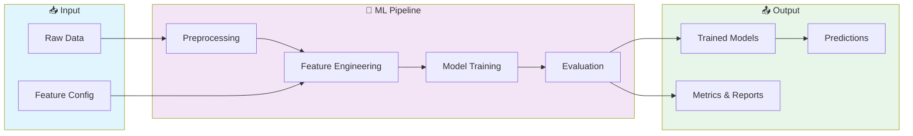
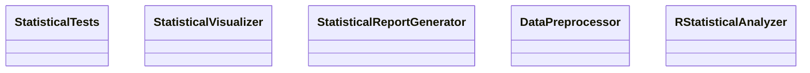

# 🚀 Advanced Statistical Analysis Toolkit

> Comprehensive statistical analysis toolkit combining R and Python for hypothesis testing, multivariate analysis, bootstrapping, and Monte Carlo simulations

[](https://img.shields.io/badge/)
[](https://img.shields.io/badge/)
[](https://img.shields.io/badge/)
[](https://img.shields.io/badge/)
[](https://img.shields.io/badge/)
[](https://img.shields.io/badge/)
[](LICENSE)

[English](#english) | [Português](#português)

---

## English

### 🎯 Overview

**Advanced Statistical Analysis Toolkit** is a production-grade Python application complemented by R, Shell that showcases modern software engineering practices including clean architecture, comprehensive testing, containerized deployment, and CI/CD readiness.

The codebase comprises **4,541 lines** of source code organized across **20 modules**, following industry best practices for maintainability, scalability, and code quality.

### ✨ Key Features

- **🏗️ Object-Oriented**: 9 core classes with clean architecture
- **📐 Clean Architecture**: Modular design with clear separation of concerns
- **🧪 Test Coverage**: Unit and integration tests for reliability
- **📚 Documentation**: Comprehensive inline documentation and examples
- **🔧 Configuration**: Environment-based configuration management

### 🏗️ Architecture





### 🚀 Quick Start

#### Prerequisites

- Python 3.12+
- pip (Python package manager)

#### Installation

```bash
# Clone the repository
git clone https://github.com/galafis/advanced-statistical-analysis-toolkit.git
cd advanced-statistical-analysis-toolkit

# Create and activate virtual environment
python -m venv venv
source venv/bin/activate  # On Windows: venv\Scripts\activate

# Install dependencies
pip install -r requirements.txt
```

#### Running

```bash
# Run the application
python src/main.py
```

### 🧪 Testing

```bash
# Run all tests
pytest

# Run with coverage report
pytest --cov --cov-report=html

# Run specific test module
pytest tests/test_main.py -v

# Run with detailed output
pytest -v --tb=short
```

### 📁 Project Structure

```
advanced-statistical-analysis-toolkit/
├── R/
│   ├── hypothesis_testing.R
│   ├── multivariate_analysis.R
│   ├── regression_analysis.R
│   ├── resampling_methods.R
│   └── utils.R
├── data/
│   ├── data/
│   │   └── sample_datasets/
│   └── generate_sample_data.py
├── examples/
│   ├── bootstrap_example.R
│   ├── complete_statistical_analysis.py
│   ├── multivariate_example.py
│   ├── regression_diagnostics.R
│   └── statistical_analysis_example.py
├── notebooks/
├── python/
│   ├── data_preprocessing.py
│   ├── r_integration.py
│   ├── report_generator.py
│   ├── statistical_tests.py
│   └── statistical_visualizations.py
├── tests/         # Test suite
│   ├── test_python_integration.py
│   └── test_r_functions.R
├── AUDIT_SUMMARY.md
├── CONTRIBUTING.md
├── LICENSE
├── README.md
├── install_r_packages.R
├── requirements.txt
└── run_all_tests.sh
```

### 🛠️ Tech Stack

| Technology | Description | Role |
|------------|-------------|------|
| **Python** | Core Language | Primary |
| **NumPy** | Numerical computing | Framework |
| **Pandas** | Data manipulation library | Framework |
| **Plotly** | Interactive visualization | Framework |
| **scikit-learn** | Machine learning library | Framework |
| **Streamlit** | Data app framework | Framework |
| R | 9 files | Supporting |
| Shell | 1 files | Supporting |

### 🤝 Contributing

Contributions are welcome! Please feel free to submit a Pull Request. For major changes, please open an issue first to discuss what you would like to change.

1. Fork the project
2. Create your feature branch (`git checkout -b feature/AmazingFeature`)
3. Commit your changes (`git commit -m 'Add some AmazingFeature'`)
4. Push to the branch (`git push origin feature/AmazingFeature`)
5. Open a Pull Request

### 📄 License

This project is licensed under the MIT License - see the [LICENSE](LICENSE) file for details.

### 👤 Author

**Gabriel Demetrios Lafis**
- GitHub: [@galafis](https://github.com/galafis)
- LinkedIn: [Gabriel Demetrios Lafis](https://linkedin.com/in/gabriel-demetrios-lafis)

---

## Português

### 🎯 Visão Geral

**Advanced Statistical Analysis Toolkit** é uma aplicação Python de nível profissional, complementada por R, Shell que demonstra práticas modernas de engenharia de software, incluindo arquitetura limpa, testes abrangentes, implantação containerizada e prontidão para CI/CD.

A base de código compreende **4,541 linhas** de código-fonte organizadas em **20 módulos**, seguindo as melhores práticas do setor para manutenibilidade, escalabilidade e qualidade de código.

### ✨ Funcionalidades Principais

- **🏗️ Object-Oriented**: 9 core classes with clean architecture
- **📐 Clean Architecture**: Modular design with clear separation of concerns
- **🧪 Test Coverage**: Unit and integration tests for reliability
- **📚 Documentation**: Comprehensive inline documentation and examples
- **🔧 Configuration**: Environment-based configuration management

### 🏗️ Arquitetura


### 🚀 Início Rápido

#### Prerequisites

- Python 3.12+
- pip (Python package manager)

#### Installation

```bash
# Clone the repository
git clone https://github.com/galafis/advanced-statistical-analysis-toolkit.git
cd advanced-statistical-analysis-toolkit

# Create and activate virtual environment
python -m venv venv
source venv/bin/activate  # On Windows: venv\Scripts\activate

# Install dependencies
pip install -r requirements.txt
```

#### Running

```bash
# Run the application
python src/main.py
```

### 🧪 Testing

```bash
# Run all tests
pytest

# Run with coverage report
pytest --cov --cov-report=html

# Run specific test module
pytest tests/test_main.py -v

# Run with detailed output
pytest -v --tb=short
```

### 📁 Estrutura do Projeto

```
advanced-statistical-analysis-toolkit/
├── R/
│   ├── hypothesis_testing.R
│   ├── multivariate_analysis.R
│   ├── regression_analysis.R
│   ├── resampling_methods.R
│   └── utils.R
├── data/
│   ├── data/
│   │   └── sample_datasets/
│   └── generate_sample_data.py
├── examples/
│   ├── bootstrap_example.R
│   ├── complete_statistical_analysis.py
│   ├── multivariate_example.py
│   ├── regression_diagnostics.R
│   └── statistical_analysis_example.py
├── notebooks/
├── python/
│   ├── data_preprocessing.py
│   ├── r_integration.py
│   ├── report_generator.py
│   ├── statistical_tests.py
│   └── statistical_visualizations.py
├── tests/         # Test suite
│   ├── test_python_integration.py
│   └── test_r_functions.R
├── AUDIT_SUMMARY.md
├── CONTRIBUTING.md
├── LICENSE
├── README.md
├── install_r_packages.R
├── requirements.txt
└── run_all_tests.sh
```

### 🛠️ Stack Tecnológica

| Tecnologia | Descrição | Papel |
|------------|-----------|-------|
| **Python** | Core Language | Primary |
| **NumPy** | Numerical computing | Framework |
| **Pandas** | Data manipulation library | Framework |
| **Plotly** | Interactive visualization | Framework |
| **scikit-learn** | Machine learning library | Framework |
| **Streamlit** | Data app framework | Framework |
| R | 9 files | Supporting |
| Shell | 1 files | Supporting |

### 🤝 Contribuindo

Contribuições são bem-vindas! Sinta-se à vontade para enviar um Pull Request.

### 📄 Licença

Este projeto está licenciado sob a Licença MIT - veja o arquivo [LICENSE](LICENSE) para detalhes.

### 👤 Autor

**Gabriel Demetrios Lafis**
- GitHub: [@galafis](https://github.com/galafis)
- LinkedIn: [Gabriel Demetrios Lafis](https://linkedin.com/in/gabriel-demetrios-lafis)
